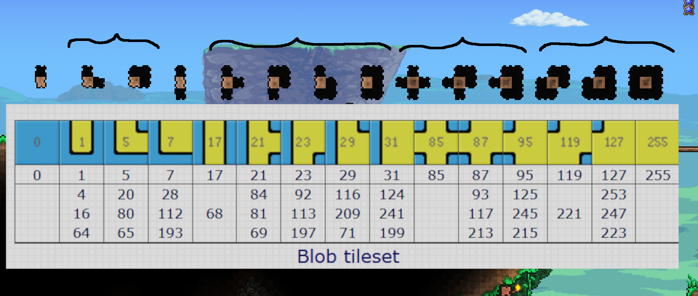
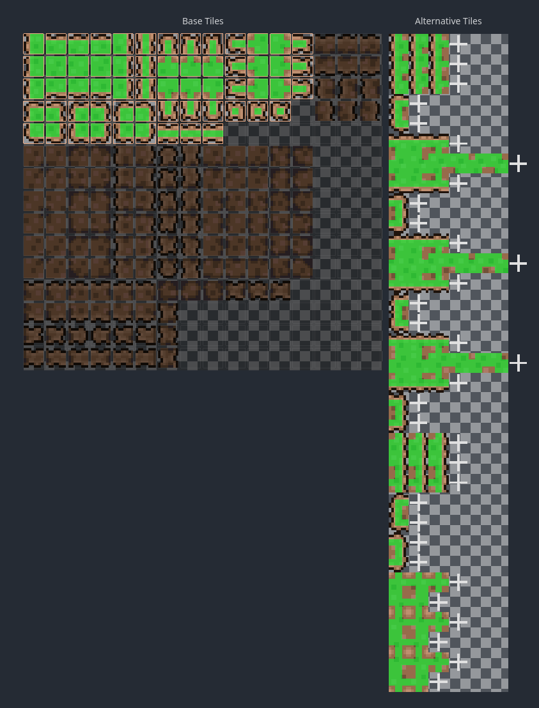

Terraria uses a [blob tileset](http://www.cr31.co.uk/stagecast/wang/blob.html),
but some tiles are re-used for multiple tile bitmaps.
In the following picture, the curly brackets group the same tiles:

Godot doesn't automatically guess how to re-use tiles for the missing variants,
so we need to draw all the possible bitmasks.

One way would be to duplicate some tiles in the tilesheet.

Another way is to use the alternative tiles feature in Godot, which is what I did.
One quirk I found is that you can't select multiple "alternative tiles" the same way you can select multiple regular tiles,
so you have to assign the collision shape to each alternative tile individually.

So basically, you have to duplicate some tiles 1, 2 or 3 times,
and then draw the bitmask like this:

# Useful resources
- [Basic Tile · tModLoader/tModLoader Wiki](https://github.com/tModLoader/tModLoader/wiki/Basic-Tile)
- [Terraria World Basics](https://tconfig.fandom.com/wiki/Terraria_World_Basics)